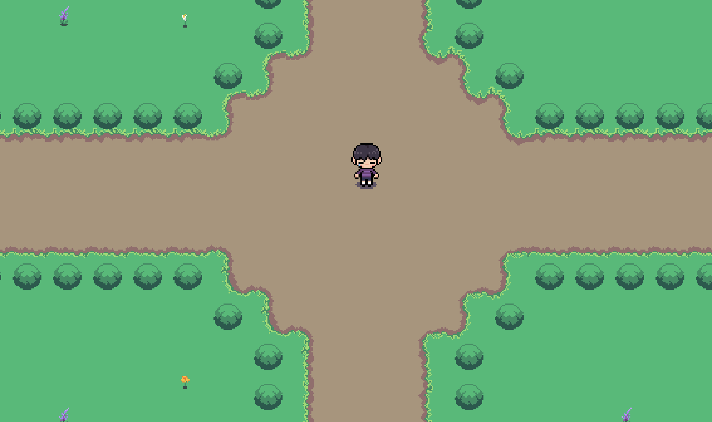

# GOL

My portfolio, built as a small top-down pixel-art RPG. Instead of scrolling through a page, you walk around a garden and talk to its residents to find my projects, links, and contact info.

**▶ Play it at [joshtsen.com](https://joshtsen.com)**



## What's in it

- **Explorable world.** A tile map built in Tiled, with collision, props, foliage that sways in the wind, and a map you can open.
- **Branching dialogue.** NPCs have nested dialogue trees, so a conversation can open a link, branch into follow-up questions, or change the NPC's reaction.
- **Hand-made art.** I drew the character spritesheet, NPCs, garden tiles, and UI boxes myself in Aseprite.
- **Handwritten font.** All in-game text renders in a font I drew by hand.
- **Hand-painted loading screen.** A frame-by-frame flower bloom tied to load progress, with a handwritten 1–100 counter.

## Controls

| Key                 | Action                     |
| ------------------- | -------------------------- |
| `WASD` / arrow keys | Move                       |
| `E` / `Space`       | Interact, advance dialogue |
| `C`                 | Controls                   |
| `M`                 | Map                        |
| `Esc`               | Close menu                 |

## Running locally

**Requirements:** Node.js 22.12.0+.

```bash
git clone https://github.com/elohimuadi/portfolio.git
cd portfolio
npm install
npm run dev        # http://localhost:4321
```

`npm run build` outputs a static site to `dist/`. The live site deploys to Vercel at [joshtsen.com](https://joshtsen.com).

## Project structure

```
src/
├── pages/index.astro        # Single page that mounts the game
├── components/Game.astro    # Phaser container
└── game/
    ├── scenes/              # Boot (loading), Intro, World, Transition, Font
    ├── content/             # NPC and project dialogue content
    ├── maps/                # Map data
    └── handfont.ts          # Handwritten font renderer
public/assets/               # Sprites, tilesets, Tiled map (.tmj), audio
```

To change what an NPC says, edit `src/game/content/interactables.ts`. Dialogue is plain data, with no Phaser code involved.

## Built with

[Astro](https://astro.build) · [Phaser 3](https://phaser.io) · [Tiled](https://www.mapeditor.org) · [Aseprite](https://www.aseprite.org) · TypeScript · Vercel

## License

Code is released under the [MIT License](LICENSE). Art, sprites, font, and audio are © Josh Tsen and may not be reused without permission.
